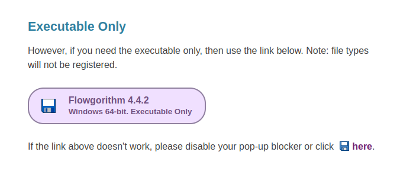
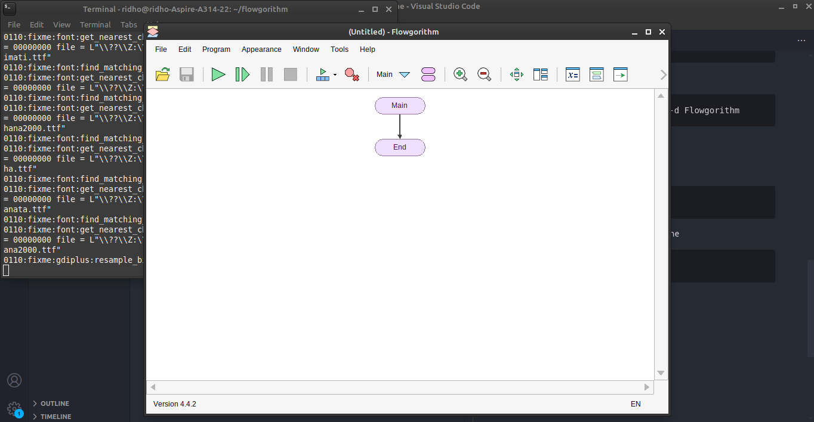
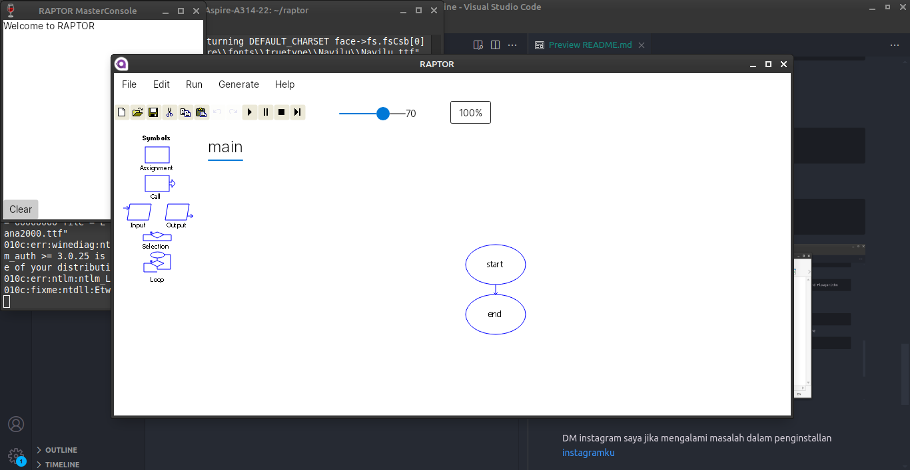

# Cara install Flowgorithm dan Raptor di Linux Mint, Ubuntu, Debian

## 1. Install wine
Wine merupakan software yang dapat menjalankan aplikasi yang memiliki ekstensi file .exe

### 1. Tambahkan Repositori WineHQ
```
sudo dpkg --add-architecture i386
sudo apt update
wget -nc https://dl.winehq.org/wine-builds/winehq.key
sudo apt-key add winehq.key
sudo add-apt-repository 'deb https://dl.winehq.org/wine-builds/ubuntu/ focal main'
```
### 2. Instal Wine Terbaru:
```
sudo apt update
sudo apt install --install-recommends winehq-stable
```
### 3. Verifikasi Instalasi
Pastikan Wine terinstal dengan benar dengan menjalankan:
```
wine --version
```
### 4. Periksa Konfigurasi Wine
Buka wine configuration
```
winecfg
```
Ubah versi Windows yang digunakan, misalnya ke Windows 7 atau Windows 10.

## 2. Cara Install Flowgorithm

### 1. Download Flowgorithm Executable Only
[Flowgorithm Download](http://www.flowgorithm.org/download/index.html)



### 2. Unzip `Flowgorithm-exe-only.zip`
Buat folder sebagai tempat unzip file
```
mkdir flowgorithm
```
Unzip file
```
unzip Flowgorithm-exe-only.zip -d flowgorithm
```

### 3. Install Flowgorithm
Arahkan terminal ke folder `flowgorithm`
```
cd flowgorithm
```
Buka `Flowgorithm.exe` menggunakan wine
```
wine Flowgorithm.exe
```

Flowgorithm berhasil diinstall

DM instagram saya jika ingin bertanya-tanya atau mengalami masalah dalam penginstallan <br>
[DM](https://www.instagram.com/ridho.setia_wan_?igsh=Z2ViZ3o4dTUyNzJv)

## 2. Cara Install Raptor

### 1. Download ZIP of Raptor Avalonia
[Raptor Linux Download](https://raptor.martincarlisle.com/raptor_avalonia.zip)

### 2. Download .NET Dekstop Runtime
[.NET Download](https://dotnet.microsoft.com/en-us/download/dotnet/thank-you/runtime-desktop-8.0.8-windows-x64-installer?cid=getdotnetcore)

### 3. Install .NET Menggunakan Wine
```
wine windowsdesktop-runtime-8.0.8-win-x64.exe
```

### 4. Unzip `raptor_avalonia.zip`
Buat folder sebagai tempat unzip file
```
mkdir raptor
```
Unzip file
```
unzip raptor_avalonia.zip -d raptor
```

### 5. Install Raptor
Arahkan terminal ke folder `raptor`
```
cd raptor
```
Buka `raptor.exe` menggunakan wine
```
wine raptor.exe
```

Raptor berhasil diinstall

DM instagram saya jika ingin bertanya-tanya atau mengalami masalah dalam penginstallan <br>
[DM](https://www.instagram.com/ridho.setia_wan_?igsh=Z2ViZ3o4dTUyNzJv)